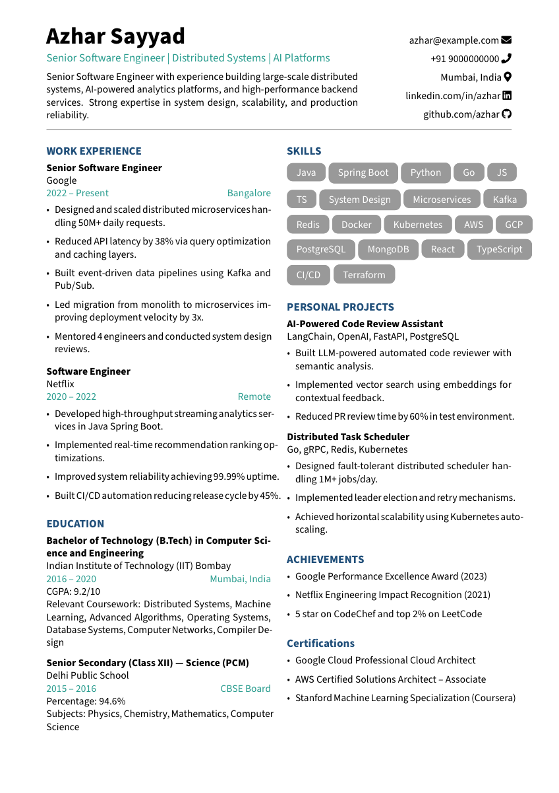

# 🧾 Professional Resume LaTeX Template

> Clean, modern, and highly maintainable 2-column resume template built in LaTeX.


---

## ✨ Features

- ✅ Clean 2-column layout using `paracol`
- ✅ Modern typography (Source Sans Pro)
- ✅ Custom skill tags
- ✅ Reusable macros for projects & experience
- ✅ Easily maintainable structure
- ✅ Minimal spacing for maximum content fit
- ✅ ATS-friendly formatting
- ✅ Fully customizable colors

---

## 📸 Preview

[](./resume-template.pdf)

Click the preview image to open the full PDF.

---

## 🚀 How To Use

### 1️⃣ Install LaTeX

Make sure you have:

- TeX Live (Linux)
- MiKTeX (Windows)
- MacTeX (Mac)
- OR use Overleaf (recommended)

---

### 2️⃣ Clone This Repository

```bash
git clone https://github.com/azhar-sayyad/resume-template.git
cd resume-template
```

---

### 3️⃣ Compile

```bash
pdflatex main.tex
```

OR simply upload to **Overleaf** and compile.

---

## 🛠 Customization Guide

### 🔹 Change Colors

```latex
\definecolor{primary}{HTML}{1F4E79}
\definecolor{accent}{HTML}{2A9D8F}
```

---

### 🔹 Add New Experience

```latex
\textbf{Job Title} \\
Company Name \\
{\color{accent} 2022 -- Present} \hfill {\color{accent} Location}

\begin{resumelist}
\item Achievement or responsibility
\item Quantified impact
\end{resumelist}
```

---

### 🔹 Add New Skill

```latex
\skill{\color{white} Java}
```

---

## 📂 Project Structure

```text
.
├── main.tex
├── README.md
├── resume-template.pdf
└── resume-preview.png
```

---

## 🎯 Ideal For

- Software Engineers
- Backend Developers
- Full Stack Engineers
- AI/ML Engineers
- System Design Profiles
- FAANG Applicants

---

## 💡 Tips

- Always quantify impact (e.g., "Reduced latency by 38%")
- Keep resume under 1 page (for < 8 years experience)
- Use strong action verbs
- Tailor per job role

---

## 📜 License

This template is licensed under the MIT License.

You are free to use, modify, and distribute.

---

## 👨‍💻 Author

**Azhar Sayyad**  
Senior Software Engineer

GitHub: [https://github.com/azhar-sayyad](https://github.com/azhar-sayyad)  
LinkedIn: [https://linkedin.com/in/sayyad-azhar](https://linkedin.com/in/sayyad-azhar)

---

⭐ If you find this helpful, consider giving the repo a star!
